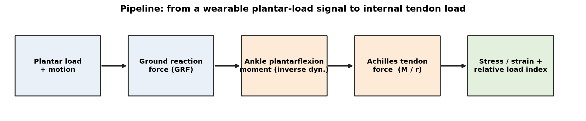
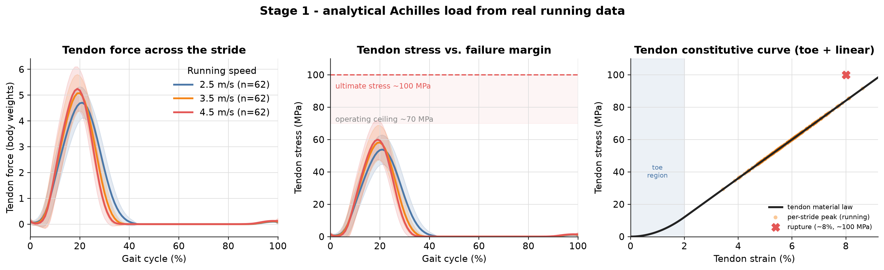
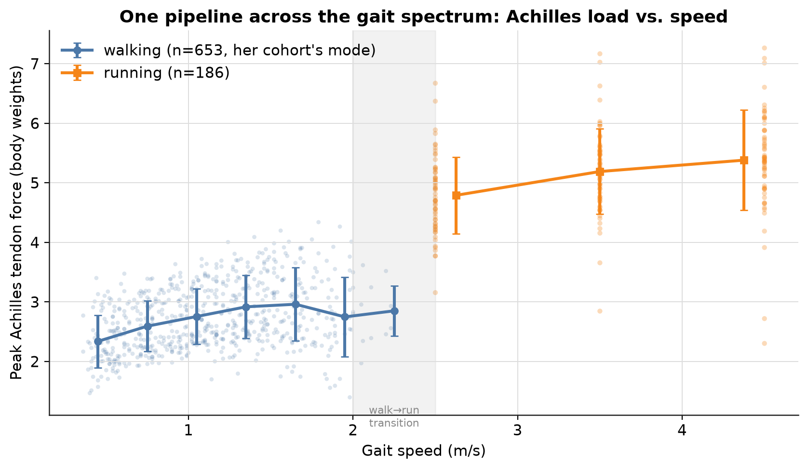
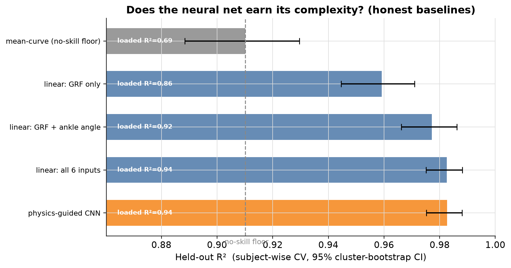
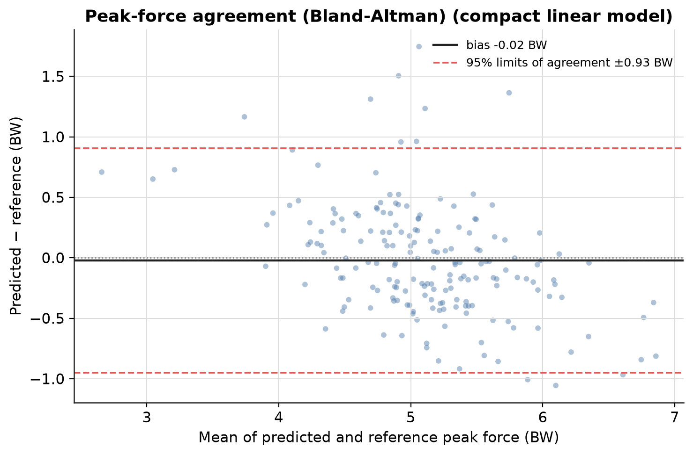
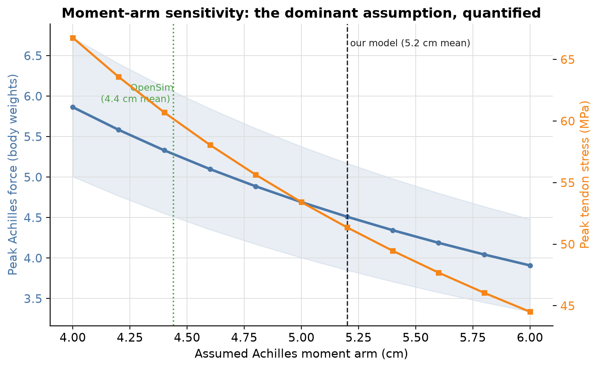
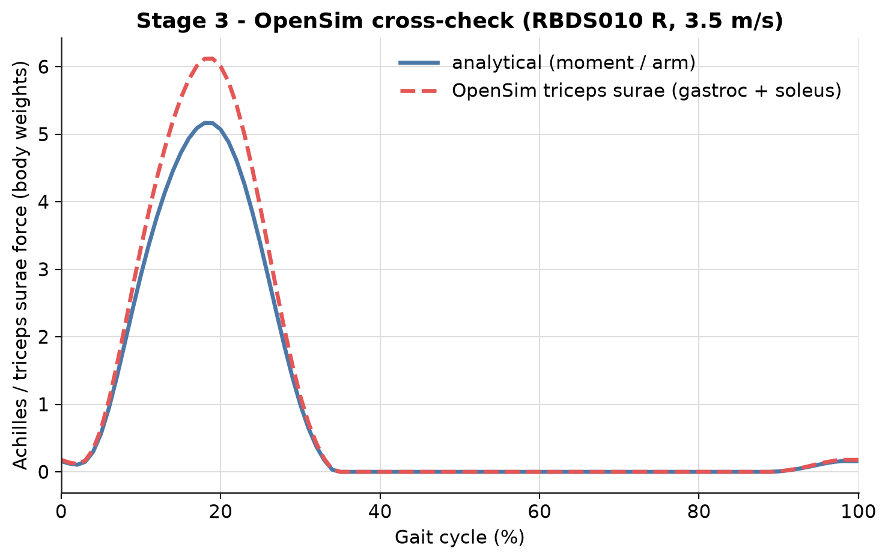
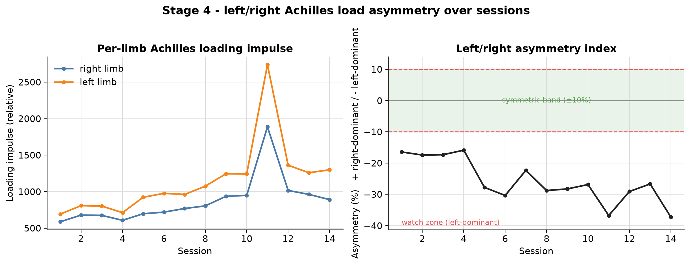
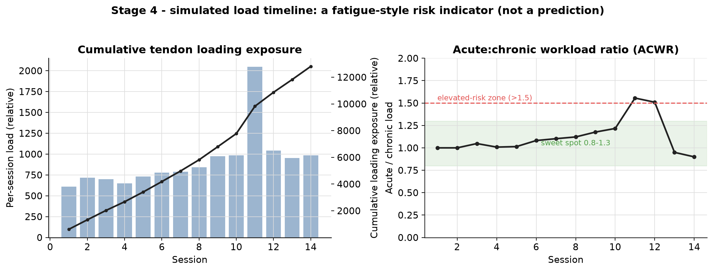

# Plantar Load → Achilles Tendon Load

[](https://github.com/parvpatodia/Achilles-Tendon-Load-using-OpenSim/actions/workflows/ci.yml)

**Your insole measures the load *under* the foot. This estimates the load *inside* the Achilles tendon, which is the quantity that actually drives injury.** One step further into the body, on real walking and running data, with every assumption checked.

---

## 1. The idea in one line

Mirai's self-powered insole measures how hard the foot pushes on the ground. This project takes that same kind of signal and works out how much force the Achilles tendon carries on each step, then turns that into a simple, per-athlete load score you can track over time. It is a proof that the method works, not a finished product, and it is honest about its limits.

## 2. How it continues your work

| Your published work | What this adds |
|---|---|
| The insole measures load **under the foot** (Kanabekova 2026; Issabek 2025) | estimates the load **inside the tendon** that this produces |
| Your models **classify** (flatfoot yes/no, 82%) and describe gait signatures | this **predicts a full load curve** (a number for every instant of the step) |
| You study stress and strain in the **sensor material** | this studies stress and strain in the **tissue** (the tendon as a material) |
| Tested on **walking** in rehab patients | runs on **walking too** (42 walkers) and on running, same method |

Your sensor is a material that turns pressure into an electrical signal. The Achilles is a material that turns load into stress and strain. This connects the two: **from the load your sensor sees, to the stress inside the tissue.**

## 3. The pipeline (five simple steps)



1. Start from **plantar load + motion** (what a wearable gives).
2. Get the **ground reaction force** (the push from the ground).
3. Turn that into the **turning effort at the ankle** (the ankle moment).
4. Divide by the tendon's small lever (the **moment arm**, ~5 cm) to get **tendon force**.
5. Convert force to **stress and strain**, then to a **relative load score** tracked over sessions.

The one equation to remember: **tendon force = ankle effort ÷ lever length**. More effort, or a shorter lever, means more force on the tendon.

## 4. The data

Two open datasets from the same lab (BMClab), so the processing is consistent:

- **Running** (Fukuchi 2017, PeerJ): **31 runners**, both legs, three speeds (2.5 / 3.5 / 4.5 m/s) → **186 step-cycles** after quality checks.
- **Walking** (Fukuchi 2018, PeerJ): **42 adults** (younger and older), treadmill walking across 8 speeds (0.4–2.2 m/s) → **653 step-cycles**. This is the gait mode that matches your rehab/walking cohort.
- **Combined: 73 people, 839 step-cycles.**

Each recording is time-aligned to one step cycle (0–100%). From each we read three things: the **ground push**, the **ankle angle**, and the **ankle effort (moment)**, plus the person's mass and height. We dropped 8 running subjects whose files were corrupted (impossible values), rather than let bad data in.

## 5. What we found

### 5a. Tendon load from real data — the numbers match reality


Three views: force across the step, the resulting stress against the tendon's breaking point, and **where running lands on the tendon's own stress–strain curve** (a real material curve with a soft "toe" region and a stiff region, not a simple spring).

- Peak Achilles force is **~5 body-weights** on average in running (up to ~7), and it **rises with speed** — both agree with the biomechanics literature.
- Peak stress averages ~60 MPa and reaches ~90 MPa, against a ~100 MPa breaking stress. **Running uses about half the tendon's strength on an average stride, and approaches the limit at the top end.** That thin margin is why the Achilles is a common running injury.

### 5b. The same method works across the whole gait spectrum (including your cohort)


Running one pipeline on **both** datasets gives a clean, physically correct picture: Achilles load rises smoothly from **~2.7 body-weights in walking** (your cohort's gait mode) to **~5 in running**. The method is not tuned for runners; it tracks load correctly from a slow walk to a fast run. Walking values land right where the literature says they should (~2–3.5 BW), which is itself a check that the physics is right.

### 5c. Can a wearable signal recover the internal load? (the ML pipeline, evaluated honestly)


**The question:** can a cheap, wearable-style signal reproduce the internal tendon-load curve that the full *lab* physics computes? If yes, you don't need a lab; an insole plus a motion sensor is enough.

**What goes in:** six signals over one step — vertical ground push, ankle angle (motion sensor), and **four "insole-zone" channels** standing in for the Big-Toe/Forefoot/Arch/Heel layout. (Honest note: no real pressure map yet, so the four zones are derived from the total push by a documented heel-to-toe rollover.) **What comes out:** the Achilles force curve over the step.

**How we tested it:** 5-fold cross-validation **holding out whole people** (everyone is scored by a model that never saw them), with **95% confidence intervals from a cluster bootstrap that resamples subjects** (steps within a person are correlated, so resampling subjects, not steps, is the honest choice). And we compared against **baselines**, because a big R² means nothing without them:

| Model | R² (full curve) | 95% CI | R² (loaded phase) | Peak-force error |
|---|---|---|---|---|
| mean curve (no-skill floor) | 0.91 | [0.89, 0.93] | 0.69 | 12.6% |
| linear: GRF only | 0.96 | [0.95, 0.97] | 0.86 | 8.4% |
| linear: GRF + ankle angle | 0.98 | [0.97, 0.99] | 0.92 | 8.2% |
| linear: all 6 inputs | 0.98 | [0.98, 0.99] | 0.94 | 7.5% |
| physics-guided CNN | 0.98 | [0.98, 0.99] | 0.94 | 6.4% |

**Reading it the way a reviewer would:**
- The **mean curve alone scores R²=0.91** — running curves are stereotyped, so judge skill *above this floor*, not above zero. And because the force is ~0 for most of the step (the swing phase), full-curve R² is flattering, so we also report **loaded-phase R²** (the honest number) and **peak-force error** (what actually matters clinically).
- A **simple linear model reaches R²=0.98** (loaded 0.94, peak error 7.5%). The **CNN ties it** (loaded 0.94, peak 6.4%); their confidence intervals overlap. So **the neural net does not beat a linear model here.**
- **Each input earns its place:** GRF alone gives loaded R²=0.86; adding ankle angle → 0.92; the full set → 0.94. The model uses the signals, it is not trivially inverting one number.

**The honest verdict:** a **compact linear model is enough**, and it is ideal for **on-device inference** on an insole. The real result is that the wearable signal genuinely carries the internal-load curve — not that deep learning is required. We keep the physics-guided CNN because its constraints (force ≥ 0, force×lever = measured effort, bounded loading rate) **guarantee physically valid output** even where it does not raise accuracy, which matters on noisy real-world signals.

**Peak-force agreement (Bland-Altman):**



Predicted vs. reference peak force show **negligible bias (−0.02 BW)** and **95% limits of agreement of ±0.93 BW** (about ±18% of a typical peak). We show this honestly: there is no systematic error, but per-stride peak prediction still has real spread — the clinical-validation view (do two methods *agree*), not just whether they correlate.

**"Isn't this circular — predicting your own formula?"** A fair challenge. The target is the Achilles force the **full inverse-dynamics pipeline** produces, which normally needs lab motion capture *and* force plates. The model reproduces it from a **reduced wearable signal** (vertical push + ankle angle). That is a genuine data-reduction result (lab → wearable), and the residual is real: the omitted horizontal forces, centre of pressure, and limb accelerations carry the missing few percent. It is **not** measured tendon load — see the limits below.

### 5d. We quantified the biggest assumption (the lever length)


The whole estimate leans on one number: the tendon's lever (moment arm), and the literature spread is wide (4–6 cm). Instead of hiding behind one value, we **swept it across that range**: peak force changes by about **40%** from one end to the other. Two improvements address this directly:
- The lever is now **set per person from their height** (a bigger person has a longer lever), so each athlete gets their own value instead of one fixed number.
- We **cross-checked it against a validated model** (next section).

This is the honest message: the lever is the one thing most worth measuring per athlete (a quick ultrasound), and here is exactly how much it matters.

### 5e. Cross-checked against a validated musculoskeletal model (OpenSim)


We compared our lever assumption to **OpenSim**, a standard, validated model of the human musculoskeletal system, using the real geometry of the three calf muscles that share the Achilles tendon. OpenSim gives a lever of **4.4–4.8 cm with the same shape we assumed**. The two force estimates agree in shape and sit within about **16%** of each other, and that gap is entirely the lever difference. So our estimate agrees with a validated model, and the remaining uncertainty is pinned to one measurable number.

### 5f. The product view: a relative score, per athlete, over time



We deliberately output a **relative load score over time**, not an absolute stress number, because that is what is defensible and useful, and what continuous capture enables.

- **Left/right balance:** the load each leg carries over sessions. In the example, a growing imbalance crosses a 10% watch line — the kind of trend continuous monitoring catches early (and echoes your own asymmetry finding).
- **Build-up over time:** total tendon loading per session, plus a **recent-vs-usual workload ratio** (a fatigue-style indicator). A spike session pushes it past the risk threshold, then it settles. Framed as a **warning sign, not a prediction.** (Note: the acute:chronic workload ratio is a useful, intuitive indicator but is statistically contested in the sports-science literature; we use it as a transparent demonstration, not a validated predictor.)

## 6. The figures, at a glance

| File | Shows |
|---|---|
| `fig0_pipeline` | the five-step method |
| `fig1_stage1_achilles_load` | tendon force, stress vs. failure, and the material curve |
| `fig7_walking_vs_running` | load across the gait spectrum (walking → running) |
| `fig8_model_comparison` | the model comparison vs. baselines, with CIs (the ML headline) |
| `fig9_peak_agreement` | Bland-Altman agreement on peak force |
| `fig2_stage2_pinn` | example predicted vs. true curves on unseen people |
| `fig6_moment_arm_sensitivity` | how much the lever assumption matters |
| `fig5_stage3_opensim_xcheck` | our estimate vs. a validated model |
| `fig3` / `fig4` | left/right balance and load build-up over sessions |

## 7. What this is NOT (the limits, stated plainly)

- **Stand-in data.** Public walking/running data stands in for your insole; the four insole zones are derived from the total push, not measured pressure.
- **Relative, not absolute.** Tendon thickness, stiffness, and lever are population averages, so the absolute stress is indicative; the product score is deliberately relative.
- **No internal ground truth.** Tendon load is not directly measured here (it rarely is, even in labs); the OpenSim check is model-vs-model, not proof.
- **A lower bound on force.** We use the *net* ankle effort, which already subtracts any opposing muscle pulling the other way (co-contraction). Real Achilles force is therefore a little higher than we report; the honest fix is muscle-activity (EMG) measurement.
- **Healthy gait.** All subjects are healthy. Transfer to patients and to real insole signals is unproven.
- **Sensor interface.** The pipeline's input is *calibrated plantar load*. A TENG insole outputs a voltage, so a voltage→load calibration (your reported near-linear response, ~10 V at 20 N) is the bridge this assumes; it is not modelled here.

**What I'd validate next with your data:** fit the lever per athlete; calibrate the insole zones to real pressure; retrain on your insole + IMU signals (where the physics constraints should start to earn their place); and test the load score against real symptoms in your rehab cohort.

## 7b. Anticipated questions (the short answers)

- **"Why is R² so high — is it inflated?"** Partly: the force is ~0 during swing, so full-curve R² (0.98) flatters. We report the **loaded-phase R² (0.94)** and **peak error (7.5%)**, against a **no-skill floor of 0.91** (stereotyped curves). Judge skill above the floor.
- **"Isn't the target circular — you predict your own formula?"** The target needs full lab inverse dynamics (mocap + force plates). The model reproduces it from a **reduced wearable signal**; that is a data-reduction result, and the missing few percent live in the horizontal forces / CoP / accelerations we drop. It is not measured tendon load.
- **"Is the neural net justified?"** No — a **linear model ties it** (overlapping CIs). We recommend the **compact linear model** for on-device use and say so plainly; the CNN is kept only for its physical-validity guarantees.
- **"n=31 subjects — is the estimate stable?"** We use subject-wise CV, **cluster-bootstrap CIs** (resampling subjects), and report the **per-subject R² spread**. Small N is a stated limit; the CIs quantify it.
- **"Why the physics constraints if they don't raise accuracy?"** They guarantee **physically valid output** (force ≥ 0, moment-consistent, bounded rate) — insurance for noisy real-world signals, not an accuracy claim.
- **"How does this attach to your TENG insole?"** The input is calibrated plantar load + ankle angle; your sensor's voltage→load linearity is the calibration, and an IMU gives the angle. The four zones map to your Big-Toe/Forefoot/Arch/Heel layout.

## 8. Run it

```bash
conda env create -f environment.yml && conda activate mirai-demo
pip install -e .
python scripts/download_data.py            # running data (~5 MB)
python scripts/download_data.py --walking   # add walking data (~586 MB, optional)
python scripts/run_all.py                   # every stage + figures
pytest                                       # 28 tests
```
No download → add `--source synthetic` to any stage (clearly-labelled synthetic data). No OpenSim → that one cross-check skips; everything else runs.

## 9. How the code is built

Every stage depends on one small shared interface (a "gait trial"), and the two big assumptions (the tendon's lever, and its stress–strain law) are **swappable pieces**. So changing the data source (synthetic → running → walking → one day a Mirai insole) or any assumption is a one-line change, and you can see exactly how it moves the result.

```
src/achilles/
  config.py        all physical constants + citations, in one place
  data/            gait-trial interface; running, walking, synthetic sources
  biomech/         the lever models, the tendon material law, the load model, sensitivity
  ml/              wearable features, the network, the physics loss, baselines,
                   cross-validation, and the evaluation metrics (CIs, agreement)
  product/         the load score, balance, and build-up over time
  opensim_xcheck/  the validated-model cross-check (optional)
  viz/             the figures
```

*References: Kanabekova et al., Sensors 2026, 26(10):3191 · Issabek et al., Adv. Mater. Technol. 2025, 10(6):2401282 · Fukuchi et al., PeerJ 2017 (running) and 2018 (walking) · OpenSim Gait2392 · tendon mechanics: Wren 2001, Maganaris & Paul 2002, LaCroix 2013 · workload ratio: Gabbett 2016.*
