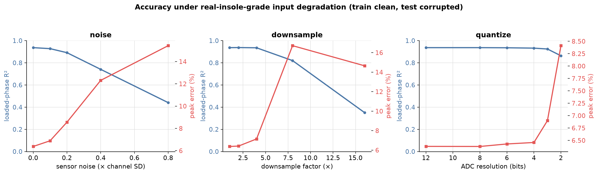
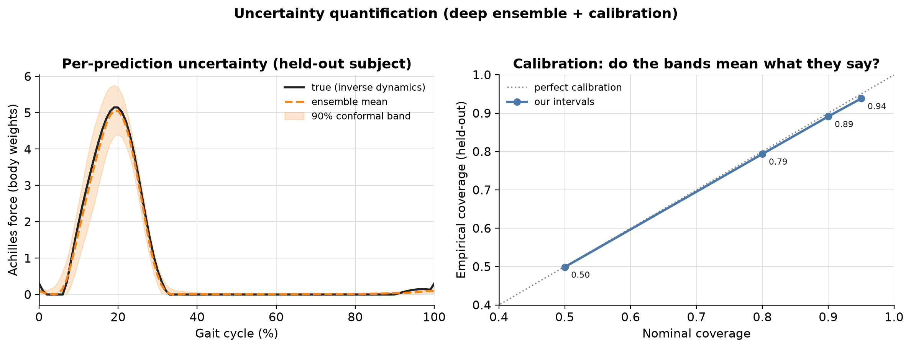
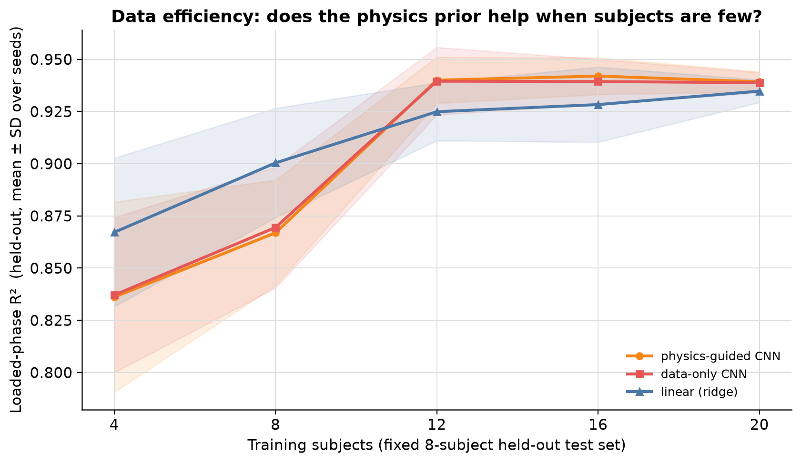

# Plantar Load to Achilles Tendon Load

[](https://github.com/parvpatodia/Achilles-Tendon-Load-using-OpenSim/actions/workflows/ci.yml)

**Your insole measures the load *under* the foot. This estimates the load *inside* the Achilles tendon, the quantity that actually drives injury.** One step further into the body, on real walking and running data, with every assumption checked.

---

## 1. The idea, and what this is

Mirai's insole measures how hard the foot pushes on the ground. This takes that kind of signal, works out how much force the Achilles tendon carries on each step, and turns it into a simple per-athlete load score you can track over time.

> **Read this first:**
> - This is a **feasibility study and a proposed direction**, built to understand the problem and explore one tractable path end to end. It is **not a validated product.**
> - **There is no non-invasive way to measure true Achilles tendon force.** So this is **data reduction**, not measurement: it reproduces the standard biomechanics-lab estimate from a cheap wearable signal. High accuracy means *"the wearable signal carries the same information as the lab calculation,"* not *"we measure tendon force accurately."*
> - **The real way to validate this is against injury outcomes, not tendon force** (see §9).

## 2. How it continues your work

| Your published work | What this adds |
|---|---|
| The insole measures load **under the foot** (Kanabekova 2026; Issabek 2025) | estimates the load **inside the tendon** that this produces |
| Your models **classify** (flatfoot yes/no, 82%) | this **predicts a full load curve** (a value for every instant of the step) |
| You study stress and strain in the **sensor material** | this studies stress and strain in the **tissue** (the tendon as a material) |
| Tested on **walking** in rehab patients | runs on **walking too** (42 walkers) and on running, same method |

Your sensor is a material that turns pressure into a signal. The Achilles is a material that turns load into stress and strain. This connects the two: from the load your sensor sees, to the stress inside the tissue.

## 3. Why the Achilles tendon, and not individual muscles

A deliberate choice, not convenience:

1. **It is what you can identify from a wearable.** A joint has more muscles than degrees of freedom, so the ankle moment does not tell you individual muscle forces (the *muscle-redundancy problem*; getting per-muscle forces needs EMG). The **Achilles is the exception**: the two calf muscles share this one tendon, so its load is their combined output and follows directly from the ankle moment. From an insole, the tendon is the internal load you can compute; individual muscle forces are not.
2. **Tendon load is also a muscle-load measure.** Muscle and tendon are in series, so the Achilles force we compute *is* the aggregate force the calf muscles produce. We are explicit that we estimate tendon stress/strain and aggregate force, not individual muscle forces.
3. **Tendon injury is common and fatigue-driven.** Achilles tendinopathy is the most common overuse injury of the lower limb (about 50% lifetime incidence in distance runners). It is a fatigue failure of the tendon material under repeated stress, so cumulative tendon stress is the right variable.
4. **It is the closest internal load to your sensor.** Plantar load, then ankle, then Achilles is the shortest inference from a plantar-pressure insole.

**Honest scope for your sports:** in basketball the Achilles is highly relevant (basketball is the leading cause of Achilles ruptures, and the push-off mechanism is exactly what this captures). In soccer the most common injury is the hamstring, a muscle an insole cannot see, though Achilles rupture is still notable (about 17% lifetime in players). So the Achilles is the right **first** target for a foot sensor, not the whole injury picture. Muscle strains need EMG-driven modelling, the natural next layer.

## 4. The pipeline (five steps)


*The method in five steps, left to right: from the load under the foot to the internal tendon load. A flow diagram, no axes.*

1. **Plantar load + motion** (what a wearable gives).
2. **Ground reaction force** (the push from the ground).
3. **Ankle moment** (the turning effort at the ankle).
4. **Tendon force** = ankle moment / moment arm (the tendon's small lever, about 5 cm).
5. **Stress and strain**, then a **relative load score** over sessions.

The one equation: **tendon force = ankle effort / lever length.** More effort, or a shorter lever, means more tendon force.

## 5. The data

Two open datasets from the same lab (BMClab), so processing is consistent:

- **Running** (Fukuchi 2017): **31 runners**, both legs, three speeds (2.5 / 3.5 / 4.5 m/s), giving **186 step-cycles**.
- **Walking** (Fukuchi 2018): **42 adults**, treadmill walking across 8 speeds (0.4 to 2.2 m/s), giving **653 step-cycles**. This matches your rehab/walking cohort.
- **Combined: 73 people, 839 step-cycles.** Each recording is time-aligned to one step cycle. We read the ground push, the ankle angle, and the ankle moment, plus mass and height. We dropped 8 runners whose files had impossible values.

## 6. What we found

### 6a. Tendon load on real data: the numbers match reality


*Three panels. Left: tendon force (y, in body-weights) across one step (x = gait cycle %, 0 to 100); the peak near 20% is push-off, and the three lines are the three running speeds. Middle: the resulting stress (y, in MPa) against the ~100 MPa breaking line. Right: the tendon's stress-strain material curve (x = stretch %, y = stress), with each runner's peak as orange dots and rupture marked with an X.*

Force across the step, the resulting stress against the tendon's breaking point, and where running lands on the tendon's own stress-strain curve (a real material curve with a soft "toe" region and a stiff region, not a simple spring).

- Peak Achilles force is **about 5 body-weights** in running (up to 7) and **rises with speed**. Both match the literature.
- Peak stress averages about 60 MPa, up to 90, against a roughly 100 MPa breaking stress. **Running uses about half the tendon's strength every stride.** That thin margin is why the Achilles is a common injury.

### 6b. The same method works from walking to running


*X = gait speed (slow walk on the left to fast run on the right); Y = peak Achilles force in body-weights. Load rises smoothly from about 2.7 (walking) to about 5 (running).*

One pipeline on both datasets: Achilles load rises smoothly from **about 2.7 body-weights in walking** (your cohort's gait mode) to **about 5 in running**. Walking values land where the literature says they should (about 2 to 3.5 BW), itself a check that the physics is right.

### 6c. Can a wearable signal recover the internal load? (the modelling, evaluated honestly)


*Each bar is one model; X = accuracy (R², higher is better) with its confidence range. The dashed line is the 0.91 "no-skill" floor. The simple linear model ties the neural net near 0.98.*

**The question:** can a cheap wearable-style signal reproduce the tendon-load curve that the full lab physics computes? **In goes** six signals over one step (the ground push, the ankle angle, and four "insole-zone" channels for your Big-Toe/Forefoot/Arch/Heel layout, derived from total push since public data has no pressure map). **Out comes** the Achilles force curve.

We tested it with **5-fold cross-validation holding out whole people** (everyone is scored by a model that never saw them), with **confidence intervals from a bootstrap that resamples subjects**, and we compared against **baselines**, because a high score means nothing without them:

| Model | R² (full curve) | 95% CI | R² (loaded phase) | Peak-force error |
|---|---|---|---|---|
| mean curve (no-skill floor) | 0.91 | [0.89, 0.93] | 0.69 | 12.6% |
| linear: ground push only | 0.96 | [0.95, 0.97] | 0.86 | 8.4% |
| linear: push + ankle angle | 0.98 | [0.97, 0.99] | 0.92 | 8.2% |
| linear: all 6 inputs | 0.98 | [0.98, 0.99] | 0.94 | 7.5% |
| physics-guided neural net | 0.98 | [0.98, 0.99] | 0.94 | 6.4% |

*(R² is how much of the curve's variation the model captures: 1.0 is perfect, 0 is no better than guessing the average. "Loaded-phase R²" is the same score over only the part of the step where the foot is on the ground and the tendon is loaded, because the foot is in the air with near-zero force for more than half the step and those easy zeros flatter the full score. Peak error is how far off the single highest force is.)*

**How to read it honestly:**
- The mean curve alone scores 0.91, because running curves all look similar, so judge skill **above this floor**. The loaded-phase R² (0.94) and the peak error (7.5%) are the real numbers.
- A **simple linear model ties the neural net** (their confidence intervals overlap). So **the neural net is not needed** here. We recommend the compact linear model: it runs on the insole's own chip.
- **Each input earns its place:** ground push alone gives loaded R² 0.86, adding ankle angle 0.92, the full set 0.94. The model uses the signals, it is not trivially inverting one number.
- Peak force agrees with the lab estimate with no systematic bias and a spread of about 0.93 BW (around 18% of a peak), which we report plainly rather than hide.
- **The worst athlete, not just the average.** Most held-out athletes are modelled very well (median loaded R² 0.96), but the single worst athlete scores 0.47. A wearable is judged on its weakest case, so we report it: the average hides one real failure mode, and the per-athlete calibration step (§9) is how you would close it.

**Is this circular, predicting your own formula?** Fair. The target needs full lab inverse dynamics (motion capture plus force plates). The model reproduces it from a reduced wearable signal, so it is a data-reduction result; the missing few percent live in the horizontal forces and accelerations we drop. It is **not** measured tendon load.

### 6d. The biggest assumption: the lever, sensitivity and cross-check


*X = the assumed tendon lever (moment arm, in cm). Blue Y = peak force (body-weights), orange Y = peak stress (MPa). Both fall as the lever grows, since force = moment / lever; about 40% swing across the plausible range.*


*X = one step (gait cycle %); Y = force in body-weights. Our simple estimate (solid) versus the validated OpenSim model (dashed); they agree within about 16%.*

Everything leans on one number, the tendon's lever (moment arm), and the literature spread is wide (4 to 6 cm). Instead of hiding behind one value we **swept it**: peak force changes about **40%** across that range. We then **cross-checked it against OpenSim**, a standard validated musculoskeletal model: it gives a lever of 4.4 to 4.8 cm with the same shape we assumed, and the two force estimates agree within about **16%**. Honest caveat: external measures like height predict the lever poorly (Sheehan 2007), so the real fix is a one-time per-athlete ultrasound. The lever is now set per person from height as a weak placeholder until then.

### 6e. Robustness and uncertainty (the real-insole reality check)


*We deliberately worsen the input to mimic a real insole. Three panels: added sensor noise, fewer readings per second (downsampling), and a coarser sensor chip (fewer ADC bits). In each, blue = accuracy, red = error. It holds up well, even with a cheap 3-bit chip.*

The R² is on **pristine lab inputs**. So we trained on clean data and tested on **progressively degraded inputs**: it holds to moderate sensor noise, stays stable to about 4x downsampling, and **survives a 3-bit ADC (loaded R² 0.92)**, which is good news for a cheap insole. The realistic operating point lives on these curves, not at the clean-data edge.



*Left: one held-out runner, with the truth (black), the prediction (dashed), and the 90% confidence band (shaded). Right: a check that the band is honest. X = the confidence we claim, Y = how often the truth actually lands inside; the points sit on the diagonal (we claim 90%, we get 89%).*

Every prediction also carries a **calibrated confidence band** (a deep ensemble for the prediction, conformal calibration for the band width). We checked the bands mean what they say: a 90% band covers 89% of unseen cases, a 95% band covers 94%. That is the direct answer to "where are your error bars?"

### 6f. The product view (illustrative)


*Over simulated sessions (x-axis). Left: the load carried by each leg. Right: the left/right difference in %, drifting out of the green "balanced" band past the watch line. Simulated to show the product idea, not a result.*

The output is a **relative, per-athlete score over time**, not an absolute stress number. Here, simulated sessions show a left/right imbalance growing past a watch line, echoing your own asymmetry finding. The same idea extends to a recent-versus-usual workload trend. This is framed as a **warning sign, not a prediction**, and the sessions are simulated to illustrate the product, not a result.

### 6g. Does the neural net, or the physics loss, ever earn its keep? (tested across cohort sizes)


*X = number of training people; Y = accuracy (loaded-phase R²) on a fixed group of 8 held-out people, averaged over 5 random draws of who is in the training set, with the spread shaded. Three lines: the physics-guided net, the same net with the physics terms switched off, and the linear model.*

Two questions a reviewer will ask, answered by measurement rather than assertion:

- **Do the physics-loss terms improve accuracy?** No. The physics-guided net and the same net with physics switched off sit on top of each other at every cohort size (gap within ±0.003 R²). The physics terms are a validity guardrail (they keep the predicted force non-negative and smooth), not an accuracy lever. We keep them for that, and claim nothing more.
- **Does the net beat the linear model when data is scarce?** No, the opposite. In the smallest cohorts (4 to 8 people, the size a pilot actually starts at) the linear model is ahead; the net needs about 12 people just to catch up, and they tie by 20. The spreads overlap, so the honest reading is "the net never wins, and trails exactly when data is scarcest."

This sharpens the recommendation from 6c: use the compact linear model. It is not only good enough on the full cohort, it is the safer choice in the small calibration cohort (§9) where a pilot begins.

## 7. What this is NOT (limits, stated plainly)

- **Stand-in data.** Public data stands in for your insole; the four zones are derived from total push, not measured pressure.
- **Relative, not absolute.** Tendon area, stiffness, and lever are population averages, so absolute stress is indicative; the product score is deliberately relative.
- **No internal ground truth.** Tendon load is not directly measured (it rarely is, even in labs); the OpenSim check is model versus model.
- **A modest lower bound.** We use the net ankle effort, so opposing-muscle co-contraction makes the true force slightly higher. For peak load this is small (about 2 to 7%, Honert & Zelik 2016) because the antagonist is quiet at push-off. EMG is the honest fix.
- **Healthy gait only.** Transfer to patients and to real insole signals is unproven.

## 8. Real-insole readiness (lab input to your hardware)

| Lab input here | On the Mirai insole | Calibration needed |
|---|---|---|
| Ground reaction force | sum of the TENG zone signals | per-zone voltage-to-force (your ~10 V at 20 N), drift compensation |
| Four zones | the four TENG regions directly | per-zone calibration (no proxy needed; we proxy only because public data lacks pressure maps) |
| Ankle angle | the paired IMU (you already use TENG + IMU) | gyro/accel fusion, drift correction |
| Body mass | entered once | none |
| Moment arm | one-time per-athlete ultrasound, else population value | imaging at onboarding |

The recommended model is a compact linear map, a few multiply-adds per step, so it runs on the insole's microcontroller with no cloud.

## 9. How you'd validate this for real

The objection is "you can't measure true Achilles force, so how do you validate it?" Three answers:

1. **Validate against injury *outcomes*, not force.** A risk indicator does not need a force ground truth; it needs to predict who gets hurt. This is how a **credit score** or **blood pressure** is validated: not by measuring a "true" hidden quantity, but by showing across a population that the number predicts the outcome. Run the index prospectively on a cohort (your rehab patients or club pilots) and test whether it flags who later develops symptoms. Honest catch: this is a multi-month study and injuries are rare events, so it needs good numbers and careful statistics.
2. **The lever uncertainty mostly cancels in the metric we output.** The product is a relative, per-athlete, over-time index. A recent-versus-usual ratio divides one load by another for the same person, so their constant lever cancels; left/right asymmetry compares two legs of the same person, so it cancels too. The absolute number is uncertain, the relative trend you act on is stable.
3. **A small calibration cohort.** Recruit 30 to 50 people of varied heights; measure each person's lever and tendon stiffness by ultrasound, and record them on the Mirai insole while also captured in a gait lab. Pretrain on public data, then fine-tune to reproduce the lab estimate from the Mirai signal. The lab estimate is the best available reference (still a model, not true force); the product is judged on the outcomes in point 1.

## 10. Run it

```bash
conda env create -f environment.yml && conda activate mirai-demo
pip install -e .
python scripts/download_data.py            # running data (~5 MB)
python scripts/download_data.py --walking   # add walking data (~586 MB, optional)
python scripts/run_all.py                   # every stage + figures
pytest                                       # 42 tests
```
No download: add `--source synthetic` to any stage. No OpenSim: that one cross-check skips, everything else runs.

## 11. How the code is built

Every stage depends on one small shared interface (a "gait trial"), and the two big assumptions (the lever and the tendon material law) are swappable pieces. So changing the data source (synthetic, running, walking, one day a Mirai insole) or any assumption is a one-line change, and you can see exactly how it moves the result.

```
src/achilles/
  config.py        physical constants + citations, in one place
  data/            gait-trial interface; running, walking, synthetic sources
  biomech/         the lever models, the tendon material law, the load model, sensitivity
  ml/              wearable features, the network, baselines, cross-validation, evaluation (CIs, calibration)
  product/         the load score, balance, build-up over time
  opensim_xcheck/  the validated-model cross-check (optional)
  viz/             the figures
```

*References: Kanabekova et al., Sensors 2026; Issabek et al., Adv. Mater. Technol. 2025; Fukuchi et al., PeerJ 2017 (running) and 2018 (walking); OpenSim Gait2392; tendon mechanics: Wren 2001, Maganaris & Paul 2002, LaCroix 2013; workload ratio: Gabbett 2016.*
